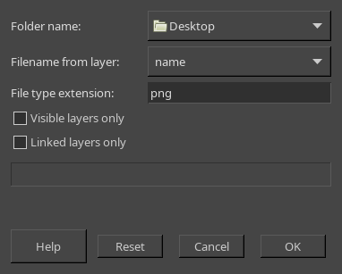

# MHL-Export Layers

This Script-Fu plugin for GIMP 3.x exports layers into separate image files.
It lets you control which layers are exported using visibility and/or selection.

## INSTALLATION

Copy `mhl-export-layers.scm` into your GIMP scripts directory and restart GIMP.

> [!TIP]
> You can find the script directories in GIMP preferences:
>
> Edit -> Preferences -> Folders -> Scripts

## USAGE

The script is available from the GIMP main menu:
> Filters -> MHL -> Export Layers

You can choose an output directory, configure file naming, and specify a file
format. Select desired layers with visibility and/or selection and set the
corresponding switches. Or turn them off when you want to export all layers.

> [!NOTE]
> This script works only with top-level layers (no recursion into groups).

## GIMP 2 (Legacy)

The previous version for GIMP 2.x is available in the
`gimp2-legacy` directory.
