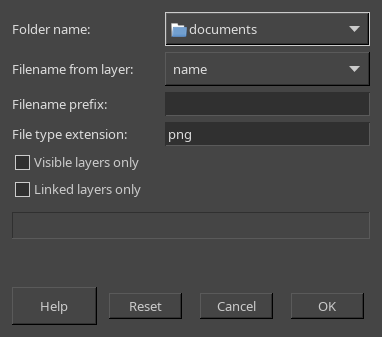

# MHL-Export Layers
GIMP Script-Fu that exports layers to separate files.
You can select desired layers with visibility or/and linking.

## INSTALLATION
Place the script file in to the Gimp scripts directory. You can find it in the preferences.
> Edit -> Preferences -> Folders -> Scripts

## USAGE

The export dialogue accessible through the `Script-Fu -> MHL-Export layers` menu.
You can point a directory to where export layers, how to name files,
specify a file type.
Also if you have selected the desired layers with visibility or/and linking,
then you can set the corresponding switches. Or turn them off when you want
to export all layers.

## Note
This is a simple alternative for the [kamilburda/gimp-export-layers](https://github.com/kamilburda/gimp-export-layers) plug-in.
And it can save you some time when you don't want to install Python2 😄.

